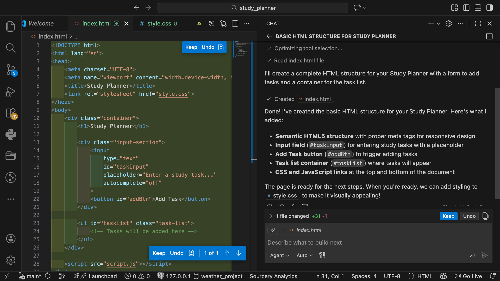
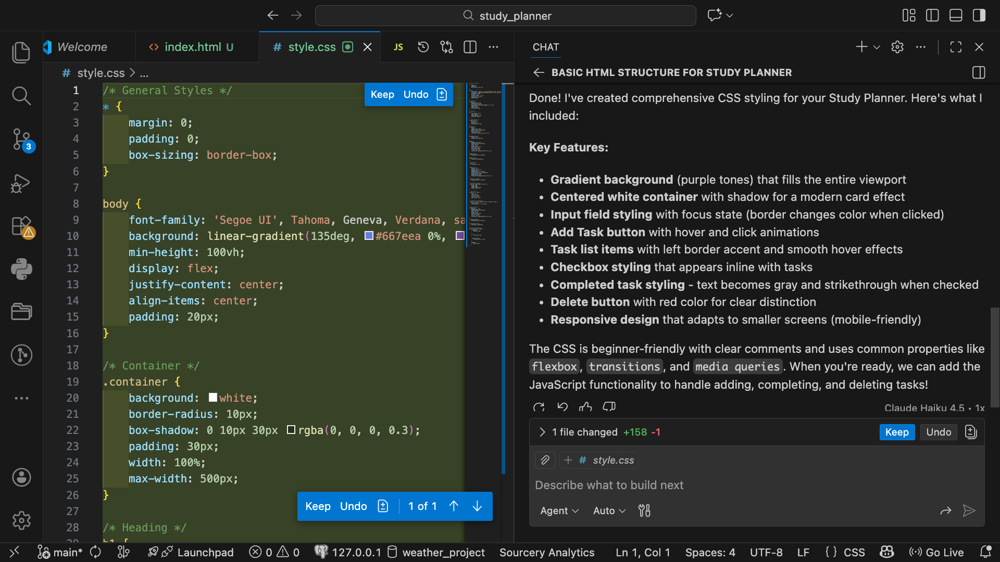
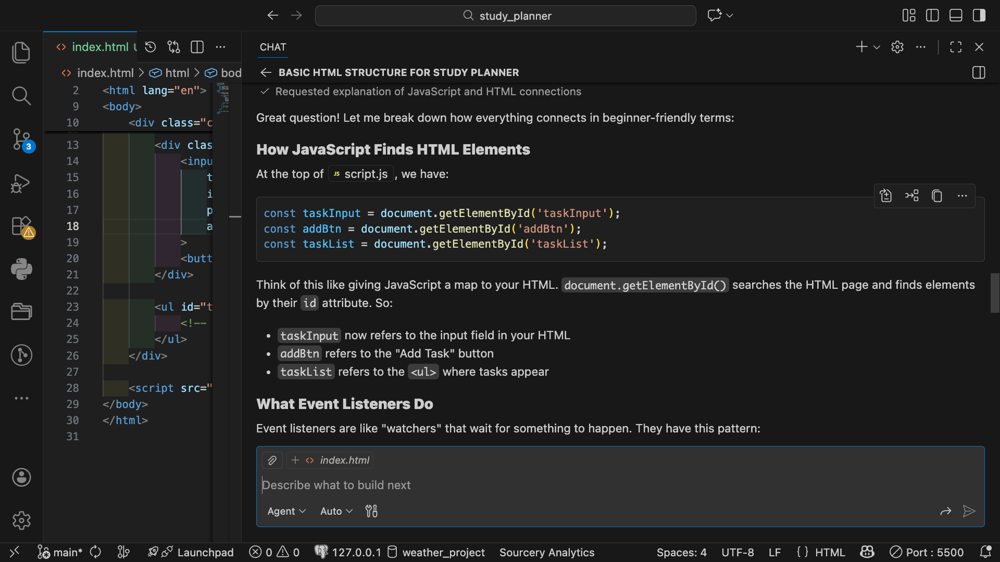

# Study Planner Reflection

## 1. What did you ask Copilot to help you build? How did you break down the problem?

I asked GitHub Copilot to help me build a simple study planner using HTML, CSS, and JavaScript. I wanted the user to be able to add study tasks, mark tasks as completed, and delete tasks. Instead of asking Copilot to create the entire application at once, I broke it down into smaller steps. I first asked it to create the basic HTML structure and then I asked it to style the page with CSS. Finally I asked it to add the JavaScript functionality. Breaking it down this way made it easier for me to understand what Copilot was adding to the project.

### Copilot Evidence

## 2. How did your approach to asking questions change as you worked?

At first, I gave Copilot more general instructions about what I wanted the study planner to do. As I continued working, I started making my prompts more specific and focused on one feature at a time. For example, instead of just asking it to make the application interactive, I specifically asked for the Add Task button, checkboxes, delete buttons, and the ability to press Enter to add a task. I realized that giving Copilot clear and detailed instructions made its responses more useful and easier to understand.

### Copilot Evidence

## 3. What parts of the development process with GitHub Copilot surprised you?

I was surprised by how quickly GitHub Copilot was able to create working code from the instructions I gave it. I expected that I would have to make a lot of corrections, but the Study Planner worked when I tested it in the browser. I was also surprised that Copilot could explain the code it generated in simple terms. This was helpful because I could ask it how certain parts worked instead of just accepting code that I did not understand.

## 4. What did you learn about the technology you used that you didn't know before?

I learned more about how JavaScript connects to HTML to make a webpage interactive. Copilot explained how `document.getElementById()` can find specific HTML elements and how event listeners wait for actions like clicking a button or pressing Enter. I also learned that JavaScript can create new HTML elements while the application is running. That is how each new task, checkbox, and delete button gets added to the page. Seeing these features work in my own application helped me understand JavaScript better.

### Copilot Evidence

## 5. What would you do differently if you had to build this again?

If I had to build this project again, I would spend more time planning the features I wanted before starting to code. I would also try adding more features, such as due dates, priority levels, or saving tasks so they are still there after refreshing the page. I would continue breaking my prompts into smaller steps because that made it easier to understand what Copilot was changing. I would also test the application after each new feature instead of waiting until several parts were completed.

